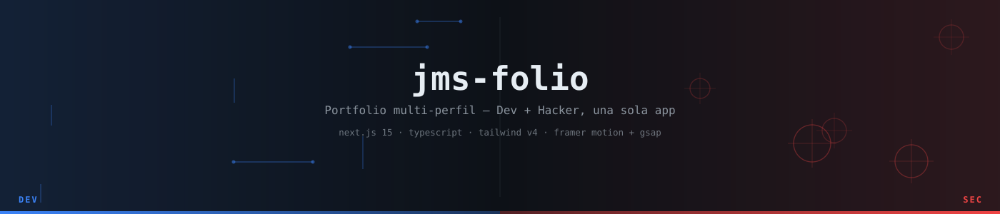

<div align="center">



[](https://jmsilva.dev)
[](https://nextjs.org)
[](https://typescriptlang.org)
[](https://tailwindcss.com)

</div>

<br>

Personal portfolio of **Juan Manuel Silva**, built as one app with two readings of the same person: a **dev** side (blue) and a **hacker** side (red), joined by a scroll-driven mode transition instead of a tab switcher. Single page, canvas pixel backgrounds per section, and a projects grid that pulls live from the GitHub API.

<br>

## Stack

| | |
|---|---|
| Framework | Next.js 15 (App Router) |
| Language | TypeScript 5, strict |
| Styling | Tailwind CSS v4 |
| Animation | Framer Motion 12 + GSAP 3 (never on the same element — see rules below) |
| Scroll | Lenis |
| Deploy | Vercel |

<br>

## Layout

```
Hero            terminal glitch intro, dual-mode cue
About           bio, photo, location
Dev             full-stack showcase, featured certs
  DevShowcase   project cards, live + repo links
ModeTransition  the actual pivot — dev fades out, hacker fades in
Hacker          security research, ArgOS collaboration, cert carousel
Projects        GitHub grid, fetched server-side, private repos always excluded
Contact         direct links, no contact-form backend by design
```

<br>

## Non-negotiable rules

These came from real bugs, not preference:

- `useGSAP()` only — never `useEffect` for GSAP. Framer Motion and GSAP never share a DOM element.
- `SmoothScrollProvider` (Lenis) mounts before any `ScrollTrigger` runs, or the pinned transition desyncs.
- GSAP pin/scrub is disabled on touch (`ScrollTrigger.isTouch === 1`) — it fights native scroll on mobile otherwise.
- `gsap.matchMedia()` gates all GSAP behind a reduced-motion variant.
- `lib/github.ts` is `server-only` — the GitHub token never reaches the client.

<br>

## Security

- Zero known dependency vulnerabilities — `pnpm audit` is clean, including two Next.js RCE advisories patched this cycle.
- `X-Content-Type-Options`, `X-Frame-Options`, `Referrer-Policy`, `Permissions-Policy` set via `next.config.ts`.
- The projects grid filters on `!repo.private` directly, not a hardcoded exclusion list — a repo going private can't leak a broken card later.

<br>

## Running it

```bash
pnpm install
pnpm dev                      # turbopack, dev only
pnpm exec next build          # production build uses webpack
pnpm exec next start
```

```env
GITHUB_USERNAME=jmsD3v   # optional, falls back to this
GITHUB_TOKEN=ghp_...     # optional — 60 req/hr without it, 5000 with it
```

<br>

## Structure

```
src/
  app/          layout.tsx (metadata, OG), page.tsx (section order), globals.css
  components/
    sections/   Hero · About · Dev · Hacker · Projects · Contact
    ui/         PixelBg · VerticalCarousel · HorizontalCertCarousel · ...
  lib/          github.ts (server-only fetch), pixel-palettes.ts, utils.ts
  types/        github.ts · projects.ts · showcase.ts · carousel.ts · about.ts · hero.ts
```

<br>

## Lighthouse

| Performance | Accessibility | Best practices | SEO |
|:---:|:---:|:---:|:---:|
| 96 | 100 | 100 | 100 |

<br>

<div align="center">
<sub>Juan Manuel Silva · <a href="https://jmsilva.dev">jmsilva.dev</a> · <a href="https://github.com/jmsD3v">@jmsD3v</a></sub>
</div>
